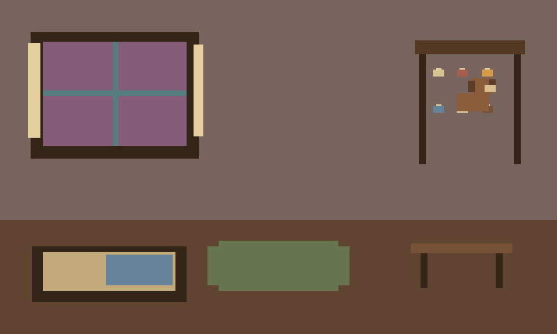
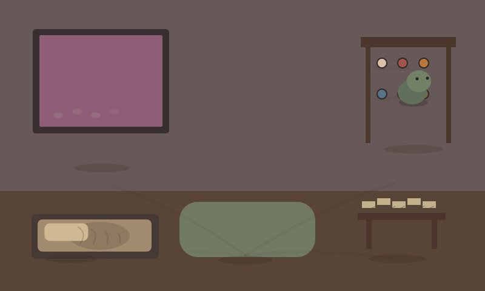
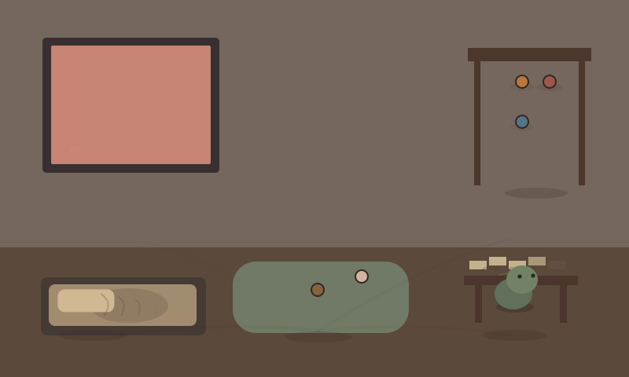
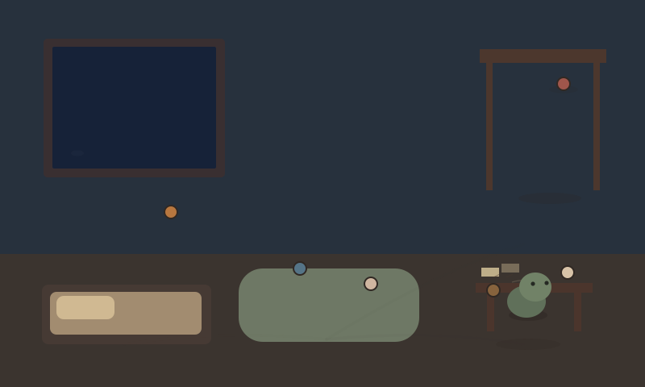
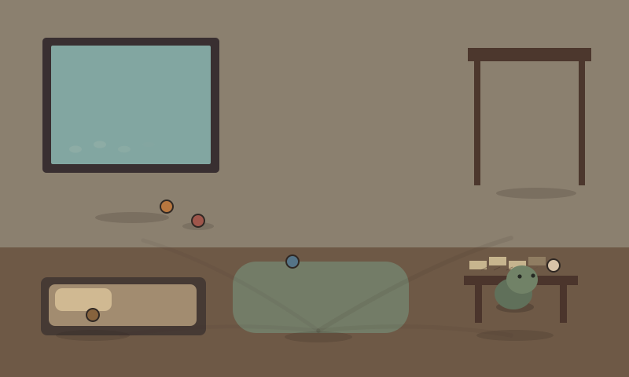
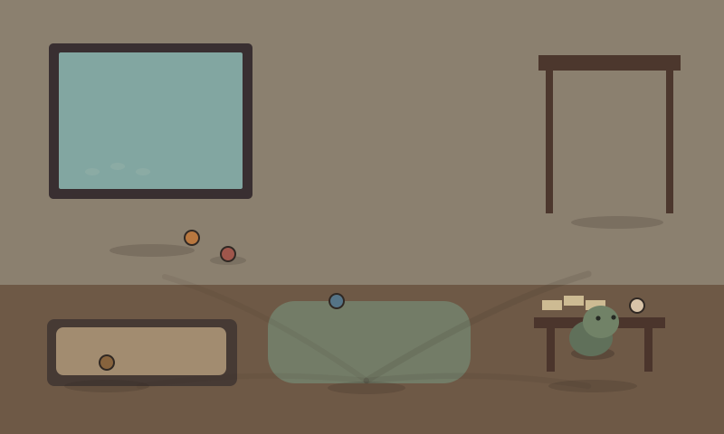
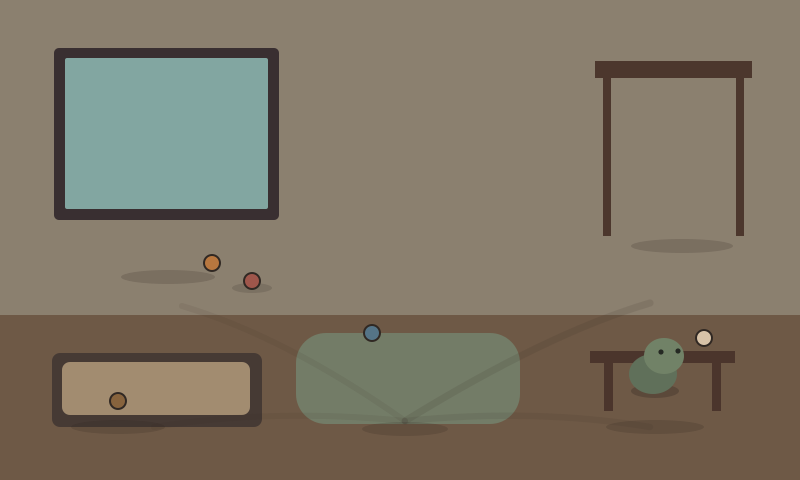
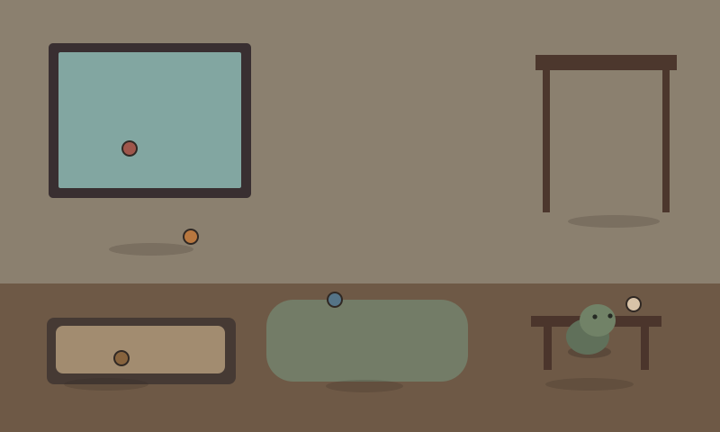

# Terrarium development snapshots

Git-friendly visual milestones. The SVG is a lightweight capture-time thumbnail; run Terrarium and open `/snapshots/` for the same stored frame through the real Canvas renderer.

## 20260827T183924459328Z-pixel-art-overhaul-iteration1

Pixel-native 400x240 Terrarium art surface with exact 2x nearest-neighbor presentation, brown floppy-eared Moss hero sprite, rebuilt warm room, persistent pixel-history marks, and palette-based day/dusk/night/weather states.

Deterministic tick `698` · renderer `b2fc125fb725`

## 20260827T175337017716Z-action-choreography-pacing

Moss now acts at authoritative targets with deliberate contact and recovery, calmer multi-tick behavior commitments, physical furniture occlusion, and a persistent 72-minute day whose dusk lighting changes gradually rather than time-lapsing.

Deterministic tick `698` · renderer `17feafe5e5c0`

## 20260827T165449319827Z-visual-maturity

Art-directed storybook diorama with calmer motion hierarchy, stronger Moss silhouette and grounding, staged object handling, and behavior presentation that commits rather than ping-pongs.

Deterministic tick `180` · renderer `a523186cab91`

## 20260827T142112545745Z-present-world-causality

Present activity now visibly engages accumulated habitat history: corrected window contact, responsive sleeping/activity surfaces, and settled object placement.

Deterministic tick `97` · renderer `acf6dc6c5a08`

## 20260827T125248568567Z-temporal-rendering-intelligence

Deterministic renderer clock, temporal Canvas capture, objective temporal auditing, real RAF probe, and smoother endpoint settling; no simulation/frame-contract/replay changes.

Deterministic tick `240` · renderer `6d27df494be5`

## 20260827T115103702156Z-temporal-aftermath-polish

Accumulated activity aftermath now emerges continuously: window traces respond subtly to weather, bedding compression and creases grow gradually, activity-corner papers/work marks layer in organically, and generic path wear is quieter so specific history remains legible.

Deterministic tick `240` · renderer `9e727e04145c`

## 20260827T054359565518Z-activity-aftermath

Repeated window-watching now leaves sill/smudge traces, activity-corner use rearranges papers and work marks, and longer-lived scenes develop a rumpled sleeping nook from actual accumulated activity history.

Deterministic tick `240` · renderer `908385163356`

## 20260827T050435058386Z-lived-in-staging

Persistent travel now reads as worn routes, while autonomous object placements settle into distinct habitat-aware positions instead of random or overlapping coordinates.

Deterministic tick `240` · renderer `4fead941b8ab`

## 20260827T041252779231Z-gen17-accepted-baseline

Accepted Gen17 Phase 0–2 visual baseline before normal product iterations.

Deterministic tick `240` · renderer `18adb0c79d3d`

